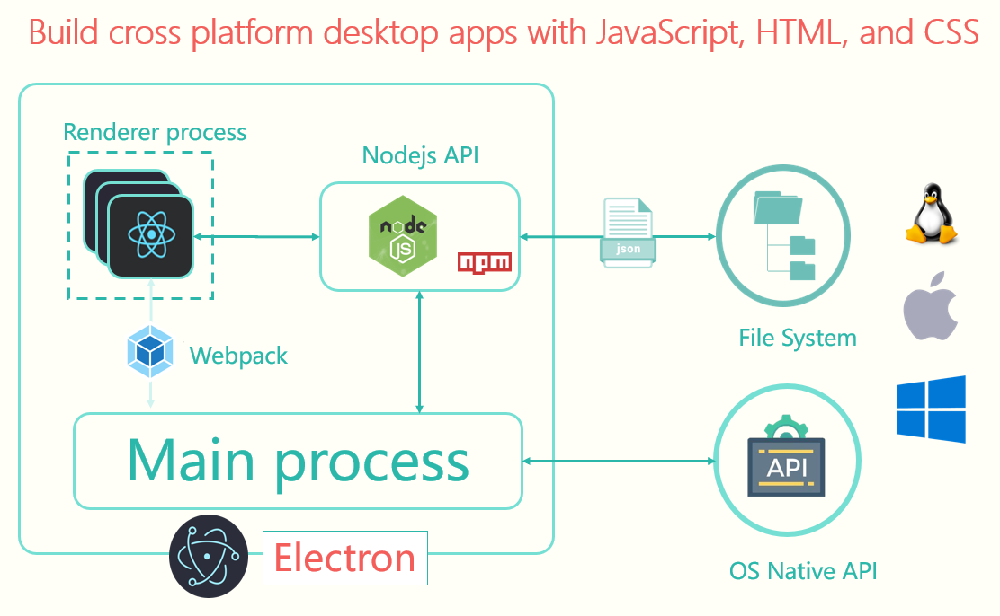

# Thinkord


Thinkord is a open source desktop application dedicated to helping people comveniently capture their thoughts.  

It was originally developed by 5 college students, we call ourself 3071, in National Central University in Taiwan. We believe capturing thoughts should not be that cumbersome, but simple and fast.  

Hope you find this application helpful. If you are interested in developing Thinkord with us, please follow this comtribution guideline. 

# Install
## Prerequiste
Download and install <a href="https://nodejs.org/en/download/">Nodejs</a> 

To clone this repo.
```git
git clone https://github.com/h164654156465/thinkord.git
```

After cloning to your destination, executing below command in your root.
```
npm install
```

If you want to develop, run
```
npm run dev
```

Below you could choose one of the options.  
(1) If you want to build this repo and test it, run 
```
npm run build
npm run start
```
(2) Otherwise, you could build and distribute it, run
```
npm run build
npm run start
npm run win
```
After packaging the application, folder dist would be created and you could click .exe to install(deploy) it to your local machine.

# Architecture
  

•	React  
    A Javascript front-end development architecture, originally developed by Facebook. We use it to build collection note and control bar. 

•	Electron & Node.js  
    A cross-platform desktop application development framework, developed by GitHub. We use it to invoke APIs that interact with the operating system. Such as screenshots, screen recording, audio recording.

•	Electron builder  
    Convert the original code to the installation package for users to use.
 

# Resources
<a href="https://h164654156465.wixsite.com/thinkord">Thinkord official website</a>

# License
<a href="https://github.com/h164654156465/thinkord/blob/master/LICENSE">GNU GPLv3 License</a>